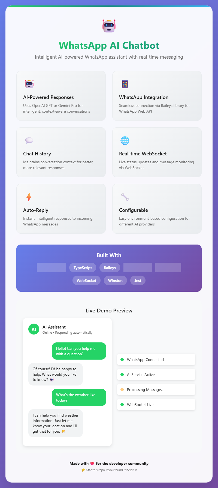

# 🤖 WhatsApp AI Chatbot

<div align="center">
  
  
  
  
  
</div>

<div align="center">
  
  
  ### 🚀 **Intelligent WhatsApp AI Assistant**
  
  *Powered by Gemini & OpenAI • Real-time Messaging • Context-Aware Responses*
</div>

---

A sophisticated WhatsApp AI chatbot built with Node.js, TypeScript, and OpenAI or Gemini (Google AI). This chatbot automatically responds to WhatsApp messages using AI-powered conversations with context awareness and real-time WebSocket communication.

## ✨ Features

- **🤖 AI-Powered Responses**: Uses OpenAI GPT or Gemini Pro for intelligent conversations
- **📱 WhatsApp Integration**: Connects via Baileys library for WhatsApp Web
- **💬 Chat History Management**: Maintains conversation context for better responses
- **🌐 Real-time WebSocket**: Live status updates and message monitoring
- **⚡ Auto-Reply**: Instant responses to incoming messages
- **🔧 Configurable**: Easy environment-based configuration
- **📊 Logging**: Comprehensive logging with Winston
- **🧪 Testing**: Jest testing framework included
- **🎯 TypeScript**: Full type safety and modern development experience
- **🔄 Provider Switch**: Easily switch between OpenAI and Gemini as your AI backend

## 🚀 Quick Start

### Prerequisites

- Node.js 18+ 
- npm or yarn
- OpenAI or Gemini API key
- WhatsApp account

### Installation

1. **Clone the repository**
   ```bash
   git clone <your-repo-url>
   cd whatsapp-ai-chatbot
   ```

2. **Install dependencies**
   ```bash
   npm install
   ```

3. **Configure environment**
   ```bash
   cp env.example .env
   ```
   
   Edit `.env` file with your configuration:
   - For **OpenAI**:
     ```env
     AI_PROVIDER=openai
     OPENAI_API_KEY=your_openai_api_key_here
     OPENAI_MODEL=gpt-3.5-turbo
     ```
   - For **Gemini**:
     ```env
     AI_PROVIDER=gemini
     GEMINI_API_KEY=your_gemini_api_key_here
     GEMINI_MODEL=gemini-pro
     ```
   - Other settings (shared):
     ```env
     PORT=3000
     MAX_HISTORY_LENGTH=50
     RESPONSE_DELAY=1000
     LOG_LEVEL=info
     AI_MAX_TOKENS=150
     AI_TEMPERATURE=0.7
     ```

4. **Build the project**
   ```bash
   npm run build
   ```

5. **Start the chatbot**
   ```bash
   npm start
   ```

6. **Scan QR Code**
   - A QR code will appear in the terminal
   - Scan it with your WhatsApp mobile app
   - The bot will be ready to respond!

## 🛠️ Development

### Available Scripts

```bash
# Development
npm run dev          # Start with hot reload
npm run build        # Build for production
npm start           # Start production build

# Code Quality
npm run lint        # Run ESLint
npm run lint:fix    # Fix linting issues
npm run format      # Format code with Prettier

# Testing
npm test            # Run tests
npm run test:watch  # Run tests in watch mode

# Utilities
npm run clean       # Clean build directory
```

### Project Structure

```
src/
├── config/         # Configuration management
├── services/       # Core services
│   ├── ai.service.ts           # OpenAI/Gemini integration
│   ├── whatsapp.service.ts     # WhatsApp connection
│   ├── chat-history.service.ts # Message history
│   ├── websocket.service.ts    # Real-time communication
│   └── chatbot.service.ts      # Main orchestrator
├── types/          # TypeScript type definitions
├── utils/          # Utilities (logging, etc.)
└── index.ts        # Application entry point
```

## ⚙️ Configuration

### Environment Variables

| Variable         | Description                        | Default           |
|------------------|------------------------------------|-------------------|
| `AI_PROVIDER`    | AI provider: `openai` or `gemini`  | `openai`          |
| `OPENAI_API_KEY` | OpenAI API key                     | *(required for OpenAI)* |
| `OPENAI_MODEL`   | OpenAI model to use                | `gpt-3.5-turbo`   |
| `GEMINI_API_KEY` | Gemini API key                     | *(required for Gemini)* |
| `GEMINI_MODEL`   | Gemini model to use                | `gemini-pro`      |
| `PORT`           | WebSocket server port              | `3000`            |
| `MAX_HISTORY_LENGTH` | Max messages in chat history    | `50`              |
| `RESPONSE_DELAY` | Delay before sending response (ms) | `1000`            |
| `LOG_LEVEL`      | Logging level                      | `info`            |
| `AI_MAX_TOKENS`  | Max tokens for AI response         | `150`             |
| `AI_TEMPERATURE` | AI response creativity (0-2)       | `0.7`             |

### AI System Prompt

The chatbot uses a configurable system prompt that instructs the AI to:
- Be friendly and conversational
- Provide helpful and accurate responses
- Keep responses concise but informative
- Use appropriate emojis when suitable
- Ask clarifying questions when needed
- Maintain context from conversation history

## 🔧 Usage

### Basic Usage

1. Start the chatbot
2. Scan the QR code with WhatsApp
3. Send a message to the connected number
4. The bot will automatically respond with AI-generated content

### WebSocket Monitoring

Connect to `ws://localhost:3000` to monitor:
- Message received/sent events
- Connection status changes
- AI response generation
- Error events

### API Endpoints

The WebSocket server provides real-time events:

```javascript
// Connect to WebSocket
const ws = new WebSocket('ws://localhost:3000');

// Listen for events
ws.onmessage = (event) => {
  const data = JSON.parse(event.data);
  console.log('Event:', data.type, data.data);
};
```

## 🧪 Testing

```bash
# Run all tests
npm test

# Run tests in watch mode
npm run test:watch

# Run with coverage
npm test -- --coverage
```

## 📊 Monitoring

The chatbot provides comprehensive monitoring:

- **Connection Status**: WhatsApp and AI service connectivity
- **Message Statistics**: Total chats and messages processed
- **Performance Metrics**: Response times and processing statistics
- **Error Tracking**: Detailed error logging and reporting

## 🔒 Security Considerations

- **API Keys**: Never commit API keys to version control
- **WhatsApp Session**: Session data is stored locally
- **Rate Limiting**: Built-in delays to prevent spam
- **Error Handling**: Comprehensive error handling and logging

## 🚀 Deployment

### Production Build

```bash
# Build for production
npm run build

# Start production server
npm start
```

### Environment Setup

1. Set `NODE_ENV=production`
2. Configure production logging
3. Set up proper error monitoring
4. Configure backup for chat history

## 🤝 Contributing

1. Fork the repository
2. Create a feature branch
3. Make your changes
4. Add tests if applicable
5. Run linting and tests
6. Submit a pull request

## 📝 License

MIT License - see LICENSE file for details

## 🙏 Acknowledgments

- [Baileys](https://github.com/WhiskeySockets/Baileys) - WhatsApp Web API
- [OpenAI](https://openai.com/) - AI language models
- [Google Gemini](https://ai.google.dev/) - Gemini AI models
- [Winston](https://github.com/winstonjs/winston) - Logging framework

## 📞 Support

For issues and questions:
- Create an issue in the repository
- Check the documentation
- Review the logs for debugging

---

<div align="center">
  <strong>Made with ❤️ for the developer community</strong>
  
  <sub>⭐ Star this repo if you found it helpful!</sub>
</div> 